# I2C Communication Protocol

> SystemVerilog I2C communication protocol  

Implementention in SystemVerilog of __I2C Communication protocol__.  

## Get Started

The source files  are located at the repository root:

- [I2C Controller](./master_I2C.sv)
- [I2C Target](./target_I2C.sv)
- [Multi-Masters Multi-Targets System](./I2C.sv)
- [I2C TB](./I2C_TB.sv)

##
This repository containts a SystemVerilog implementation of I2C controller and target modules designed in accordance with the [I2C-bus specification manual by NXP (Rev. 7.0, October 2021)](https://www.pololu.com/file/0J435/UM10204.pdf)

The two modules are built as FSMs which emcapsulte the periodic structure of the I2C protocol. It is advised to draw a simple flowchart when reading the sourcecode for better undrstanding. Shown below is a simplified version of the controller's flowchart for better understanding:
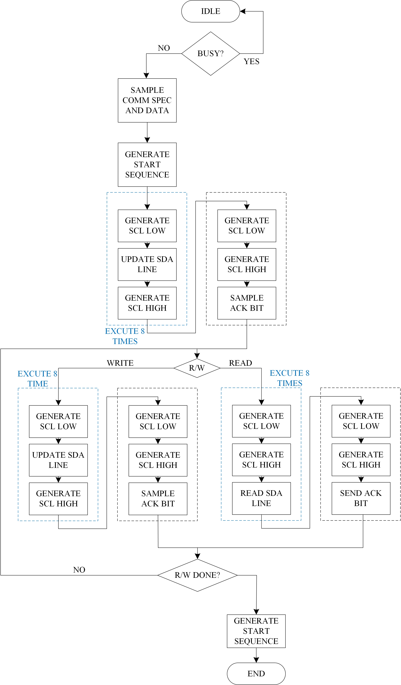 

Apart from 'vanilla' I2C protocol following features are supported:
1.  Clock stretching
2.	Clock synchronization and arbritration for multi-controller systems

All timing parameters are defined as constants which can be overidden to comply with different target'/controllers' requirement. Please refer to section 6 of the I2C bus specification manual for the definition ofthese timing intervals. 
The open drain configuration is mimicked here by using 'tri1' wire type for the SCL and SDA lines.
## Testbench

The testbench comprises five tests covering key scenarios of multi-controller (3) multi-target (2) I2C systems.

1.	Communication between controller '1' and target '1'. Write data from controller to target (3 data frames).
	Here the data sent from the controller to the peripheral unit is 24-bit long (3 data frames, 110010101111000110101111). 
	The target unit is 'target_1' (addr_1=7'b1000111) which is configured to execute byte-level clock streching.
	
	**Communication between controller '1' and target '1':**
		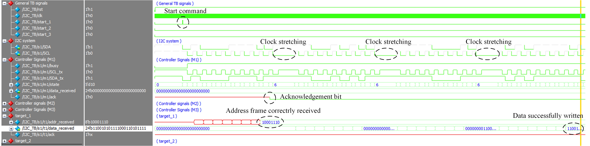  
		
2.	Communication between controller '2' and target '2'. Write data from controller to target (2 data frames).
	Here the data sent from the controller to the peripheral unit is 16-bit long (2 data frames, 0011010111001111). 
	The target unit is 'target_2' (addr_1=7'b1001111) which is configured to execute byte-level clock streching.
	
	**Communication between controller '2' and target '2':**
		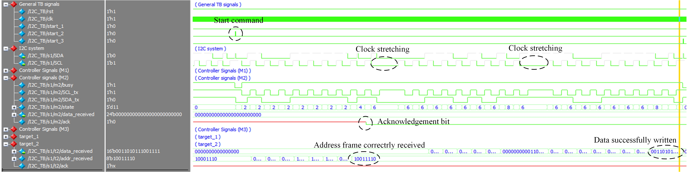  

3.	Communication between controller '3' and an unkown target (address mismatch - terminated after the acknoledgement bit)
	Here the address of the target device (7'b1111110) does not match to any existing devices on the line. 
	
	**Communication between controller '3' and unkown target device:**
		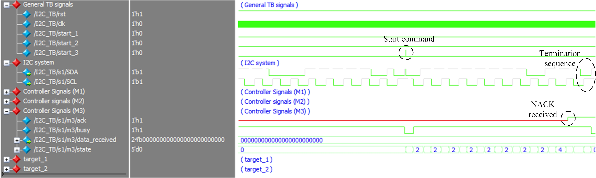  

4.	Communication between controller '1' and target '2'. Read data from target to controller (2 bytes are read)
	Note: Clock strectching is carried only when data is transferred from the controller to the target.
	
	**Communication between controller '1' and target '2':**
		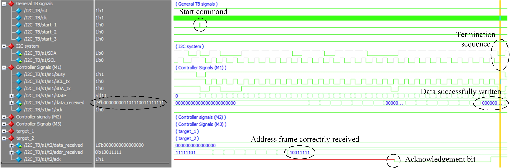  
		
5.	Communication between controller '1' and target '1'. Read data from target to controller (1 byte is read)
	Note: Clock strectching is carried only when data is transferred from the controller to the target.
	
	**Communication between controller '1' and target '1':**
		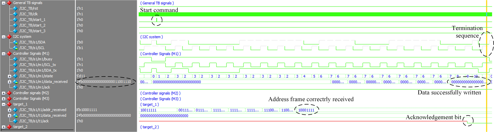  

6.	Clock synchronization and arbitration verification
	The two controllers try to control the I2C lines. The timing specifiaction of the two are deliberately different to verify the clock synchronization logic (please see the I2C protocal manual for detailed explanation). Controller '1' is the 'winner' of the arbritration procedure (after the 4th address bit).
	
	**Clock synchronization and arbitration verification: controller '1' wins the arbritration proccess:**
		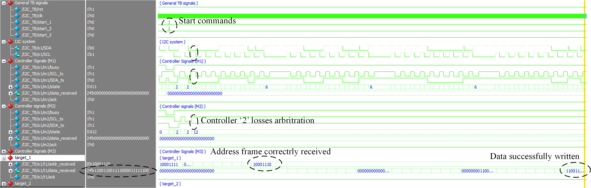  

## FPGA - DS3231 RTC Interface
A real-time-clock (RTC) IC is programmed via I2C protocol. Here, the controller module described above is realized on an altera Cyclone V FPGA while the RTC IC acts as the target device (target address 7'b1101000). 
The datasheet of the DS3231 RTC IC can be found in the following [link](https://www.analog.com/media/en/technical-documentation/data-sheets/DS3231.pdf).

1.	Setting the time and date
	The written data is : 8'h2e,8'h42,8'h45,8'h03,8'h07,8'h01,8'h72 to registers 00h->06h. This sets the time and data to: 05:42:34 Tuesday, January 7th in year 72.
	
	**Setting the time and date:**
		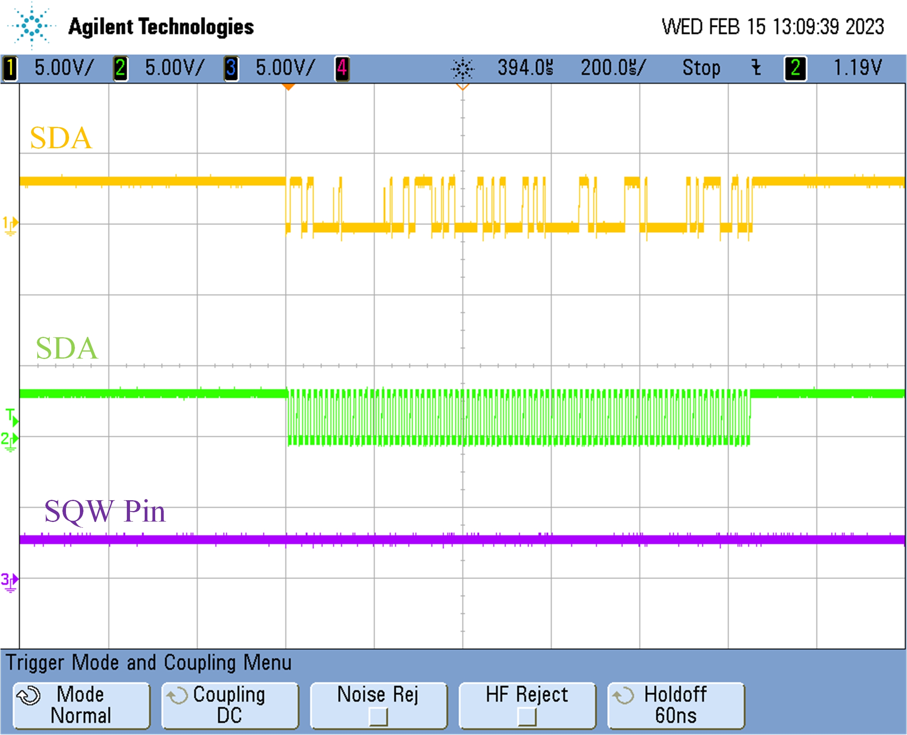  

	**Zoom in on the DS3231 address and first sent byte sent:**
		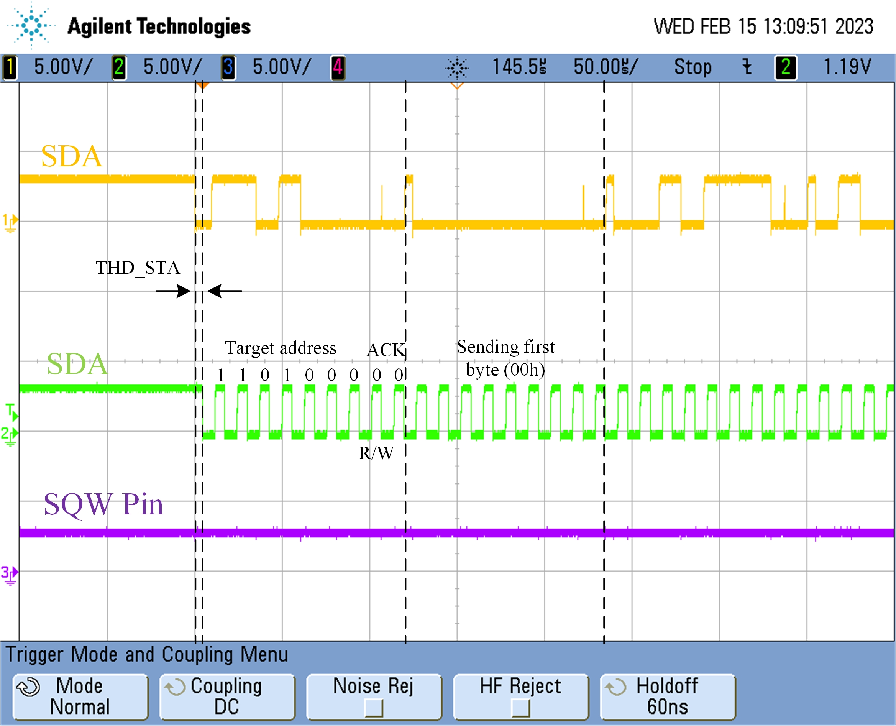  

2.	Setting the control register
	The control register is located on address 0Eh. For the purppose of visual verificatoin brought here, the command written,18h, to the control register resuls in a 8kHz squarewave on the SQW pin.
	
	**Setting the control register:**
		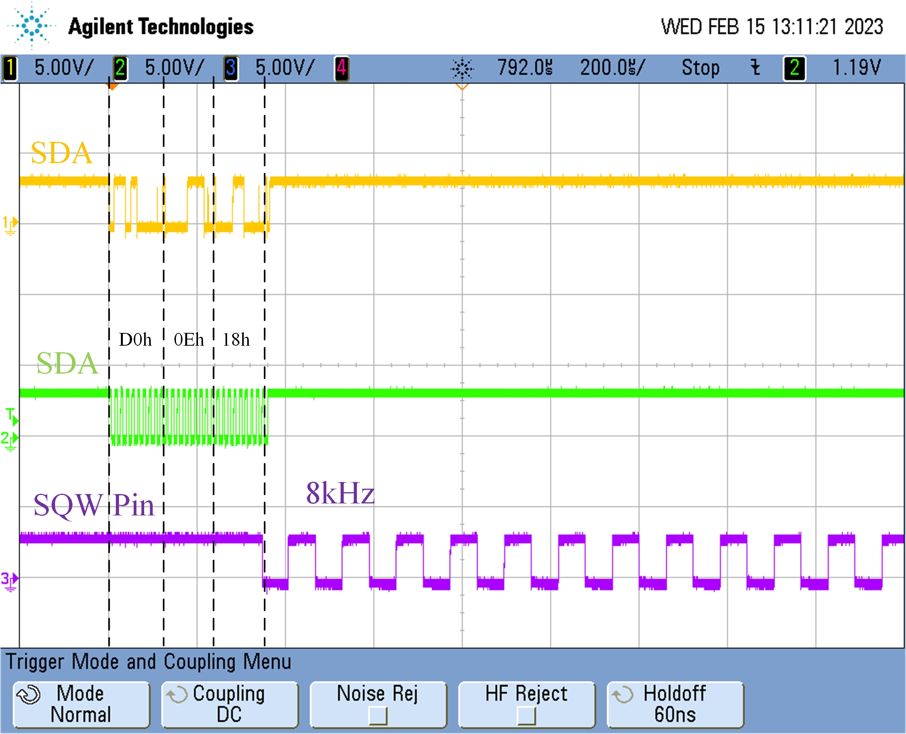  

3.	Read data from the RTC IC to the controller module in the FPGA
	The first 7 bytes indicate the current time and date while the last two are the control and status registers.
	The read data indicates the current time is: 05:43:20 Tuesday, January 7th in year 72
	
	**Read_data:**
		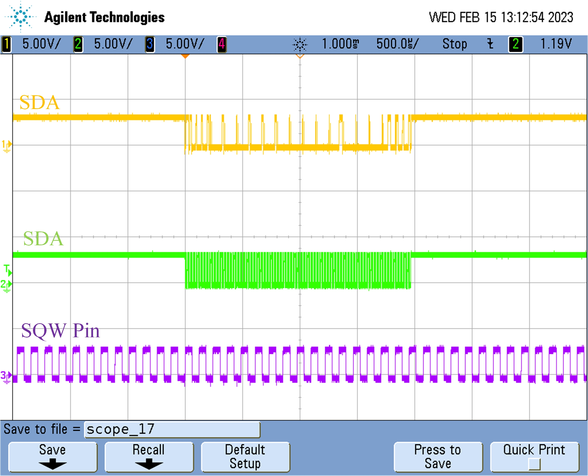 		
		
	**The read data can also be observed via the signaltap on the FPGA for verification purposes as follows:**
				
		
## Support

I will be happy to answer any questions.  
Approach me here using GitHub Issues or at tom.urkin@gmail.com