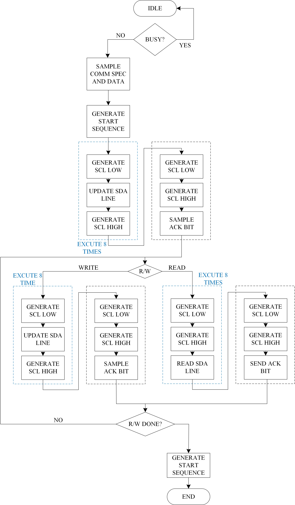

# I2C Communication Protocol

> SystemVerilog I2C communication protocol  

Implementention in SystemVerilog of __I2C Communication protocol__.  

## Get Started

The source files  are located at the repository root:

- [I2C Controller](./master_I2C.sv)
- [I2C Target](./target_I2C.sv)
- [Multi-Masters Multi-Targets System](./I2C.sv)
- [I2C TB](./I2C_TB.sv)

##
This repository containts a SystemVerilog implementation of I2C controller and target modules designed in accordance with the [I2C-bus specification manual by NXP (Rev. 7.0, October 2021)](https://www.pololu.com/file/0J435/UM10204.pdf)

The two modules are built as FSMs which emcapsulte the periodic structure of the I2C protocol. It is advised to draw a simple flowchart when reading the sourcecode for better undrstanding. Shown below is a simplified version of the controller's flowchart for better understanding:

 

Apart from 'vanilla' I2C protocol following features are supported:
1.  Clock stretching by the target
2.	Arbritation and clock synchronization for multi-controller systems

## Testbench

The testbench comprises five tests covering key scenarios of multi-controller (3) multi-target (2) I2C systems.

1.	Communication between a single periphery unit and the controller
	Here the data sent from the controller to the peripheral unit is 8-bit long, the recieved data is 16-bit long and a halt of 5 cycles is enforced betweeb communication intervals (can be observed in the SCK signal). 
	The peripheral unit is 'Periphety_0' (CS==2'b00) and therefore the CIPO line of the other units is 1'bz. The sent words (data_send_p, data_send_c) are randomly generated and compared with the recieving regiters in the controller/periphery unit. 	
	
	**Communication between a single periphery (waveform):**
		 
		
	**Communication between a single periphery (terminal):**
				
	
	Note: all communication parameters are defined as constants which can be overidden to comply with different data length, pause interval etc. 
		
## Support

I will be happy to answer any questions.  
Approach me here using GitHub Issues or at tom.urkin@gmail.com